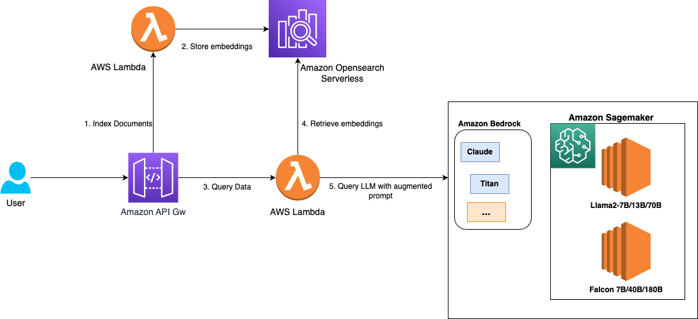

# serverless-rag-demo

AWS Bedrock + OpenSearch Serverless + Lambda + App Runner reference system for document-grounded chat and lightweight agent workflows. This repo is meant to show a real deployment shape, not just a notebook prompt demo.



## What This Repo Proves

- you can deploy a Retrieval-Augmented Generation stack on AWS with real infrastructure code
- you understand document ingestion, retrieval, grounding, and response orchestration
- you can combine a vector store, Bedrock runtime, Lambda workers, API Gateway, and a chat UI into one system
- you can discuss production notes like access policies, infra decomposition, and operational tradeoffs

## Architecture

This project is structured around a few concrete layers:

- `app.py` and `llms_with_serverless_rag/`: AWS CDK entrypoints and stack wiring
- `infrastructure/`: OpenSearch Serverless, API Gateway, Bedrock layer, ECR, and App Runner stacks
- `artifacts/bedrock_lambda/`: indexing and query Lambdas, orchestration helpers, and agent modules
- `artifacts/chat-ui/`: React chat interface for upload, chat, and document interaction flows

High-level request flow:

1. a document is uploaded and indexed through the ingestion Lambda
2. embeddings are stored in OpenSearch Serverless
3. chat requests arrive through API Gateway
4. the query Lambda classifies the request, retrieves context, and calls Bedrock
5. the frontend streams or renders the grounded response

## Infrastructure Notes

- OpenSearch Serverless is provisioned for vector search via `infrastructure/opensearch_vectordb_stack.py`
- the repo includes separate stacks for API Gateway, App Runner hosting, ECR-backed UI delivery, and Bedrock dependencies
- IAM and access policies are part of the deployment story rather than an afterthought

## Retrieval and Grounding

The query path in `artifacts/bedrock_lambda/query_lambda/query_rag_bedrock.py` includes:

- query classification and translation
- retrieval over indexed content
- optional agent routing for specialized tasks
- context injection into the model prompt
- streamed response generation from Bedrock

That makes this repo useful as a base for discussing grounded generation, orchestration, and when an application should refuse to answer without context.

## Benchmark and Eval Framing

This repo does not yet include a full offline eval harness, but it is already set up for the right next steps:

- measure retrieval hit rate on a fixed document set
- track citation presence versus unsupported answers
- record p50 / p95 end-to-end latency across upload, retrieval, and answer generation
- compare simple retrieval-only flows against agent-routed flows

## Production-Minded Details

- infra is decomposed into CDK stacks instead of hidden in one script
- the query path already separates retrieval, classification, and model invocation concerns
- the repo includes a real UI, not just backend code
- there is room to add observability, release gates, and grounded-answer evals without restructuring the system

## Local and Deployment Workflow

Install dependencies:

```bash
pip install -r requirements.txt
cd artifacts/chat-ui && npm install
```

Deploy shape:

```bash
cdk synth
cdk deploy
```

The exact AWS resources depend on your environment context and account settings in `cdk.json`.

## Limitations

- current README-level story previously undersold the actual architecture
- benchmark and eval artifacts are still lightweight
- agent flows can be tightened further with explicit release gates and trace logging
- the public demo narrative should show grounded-answer behavior more clearly

## Next Improvements

- add an offline eval suite for retrieval quality and grounded-answer compliance
- add request tracing and latency reporting
- add a short demo video or screenshots of the document chat flow
- publish sample benchmark outputs for a fixed synthetic corpus
